<div align="center">



<a href="https://git.io/typing-svg">
  
</a>

<br/>

<a href="https://www.linkedin.com/in/samia-a-a99aa5275"></a>
<a href="mailto:atmanisamia15@gmail.com"></a>


</div>



<table align="center">
<tr>
<td width="60%" valign="top">

### 🌸 About

I build things at the intersection of **data, AI and software engineering** — training NLP/CNN models, then shipping the product that wraps around them. I care about clean architecture, readable code, and models that solve real problems, not just notebooks.

```python
me = {
    "focus": ["Data Science", "Machine Learning", "Full-Stack Dev"],
    "currently_exploring": "Deep Learning architectures & MLOps",
    "philosophy": "Ship fast, measure everything, iterate.",
    "open_to": "AI / Data internships & collabs"
}
```

</td>
<td width="40%" valign="top" align="center">


</td>
</tr>
</table>


## ⚡ Tech Stack

<div align="center">

**Languages**
<br/>


**AI / Data Science**
<br/>


**Data & BI**
<br/>


**Full-Stack Engineering**
<br/>


</div>


## 🐍 Contribution Snake

<div align="center">

</div>


## 📈 GitHub Activity

<div align="center">


</div>


## 🤝 Let's Build Something

<div align="center">

<a href="mailto:atmanisamia15@gmail.com"></a>
<a href="https://www.linkedin.com/in/samia-a-a99aa5275"></a>

<br/><br/>


</div>

